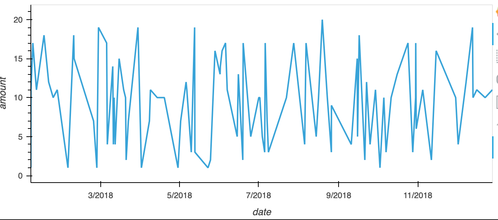
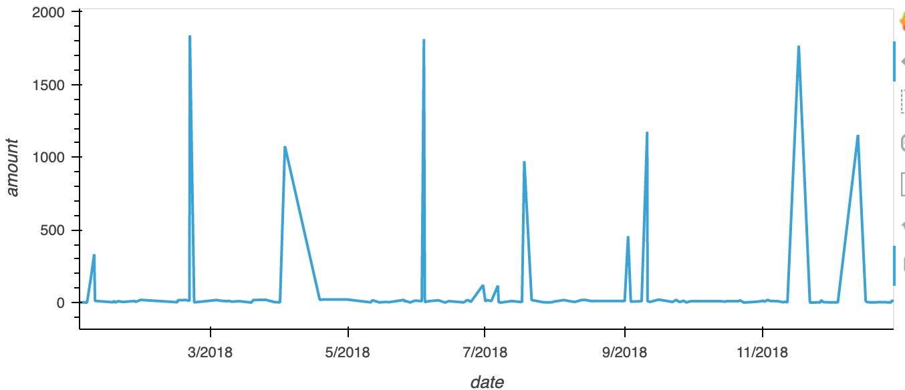
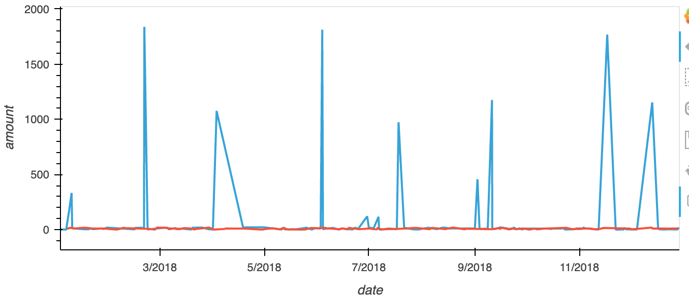
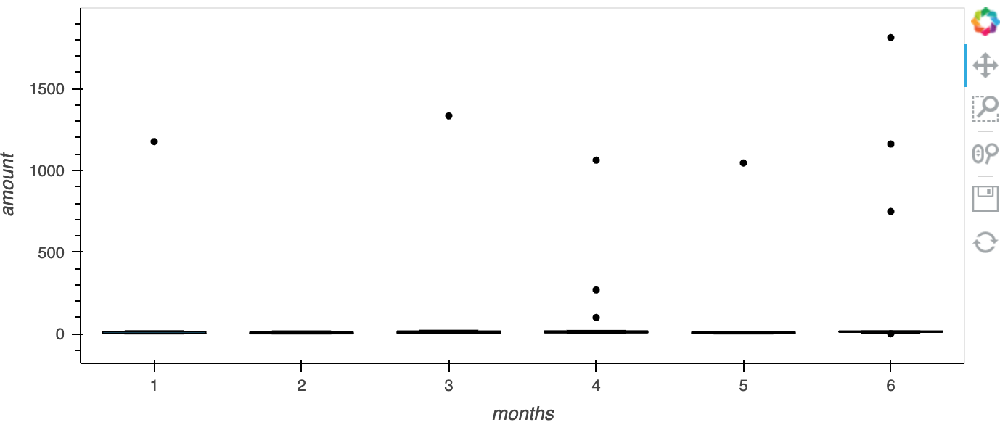

# HW-7-SQL
**PART 1:**
- There is some evidence to suggest that a credit card has been hacked. The card holder with the most transactions under 2 dollars is 8. There are many other cards with 7 and 6 transactions (under $2), so some of these cards could be hacked.

- There are 2 transactions exceeding $1500, and 7 exceeding $1000 between 07:00 and 09:00 that could be fraudulent.
- After filtering for transactions between 09:00-23:00, there seems to be more potentially fraudulent transactions during the day as compared to the early morning (7-9 am). though, It could be the case that more people are spending more money during the day.

- The top 5 merchants prone to hacks are: 
    
    (merchant ID)
1. 48
2. 63
3. 65
4. 129
5. 50

**PART 2:**

- Cardholder 2:

---
- Cardholder 18:

---
- Combined:

---
- The consumption pattern for cardholder 2 looks quite normal. The consumption pattern for cardholder 18 shows signs that the account could be hacked. This is because there were 7 transactions over 1000 dollars. As you can see in the combined graph, these transactions were a lot larger than the average for both cardholders.
---
- Question 2:

- 

- There are 7 outliers for cardholder 25. One in January, March, April, May, and three in June.
- These outliers are most likely the fraudulent transactions.